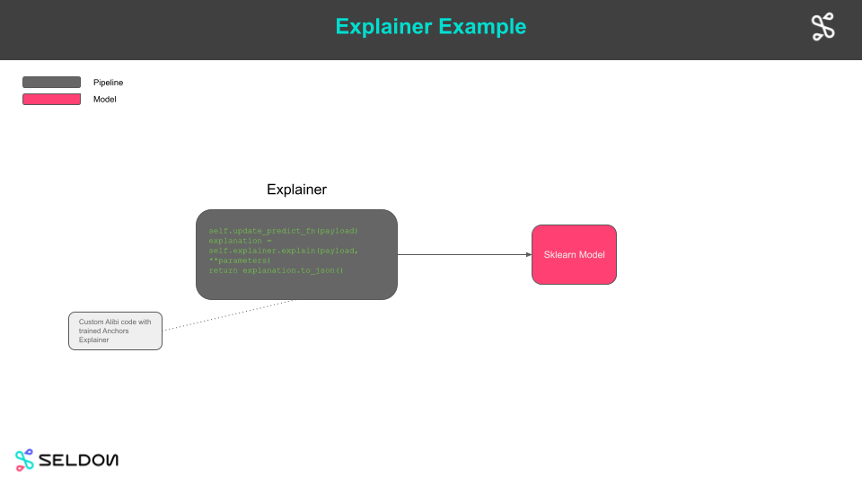

# Model Explainer Example



In this example we will:

  * [Describe the project structure](#Project-Structure)
  * [Train some models](#Train-Models)
  * [Create Tempo artifacts](#Create-Tempo-Artifacts)
  * [Run unit tests](#Unit-Tests)
  * [Save python environment for our classifier](#Save-Classifier-Environment)
  * [Test Locally on Docker](#Test-Locally-on-Docker)
  * [Production on Kubernetes via Tempo](#Production-Option-1-(Deploy-to-Kubernetes-with-Tempo))
  * [Prodiuction on Kuebrnetes via GitOps](#Production-Option-2-(Gitops))

## Prerequisites

This notebooks needs to be run in the `tempo-examples` conda environment defined below. Create from project root folder:

```bash
conda env create --name tempo-examples --file conda/tempo-examples.yaml
```

## Project Structure


```python
!tree -P "*.py"  -I "__init__.py|__pycache__" -L 2
```

## Train Models

 * This section is where as a data scientist you do your work of training models and creating artfacts.
 * For this example we train sklearn and xgboost classification models for the iris dataset.


```python
import os
import logging
import numpy as np
import json
import tempo

from tempo.utils import logger

from src.constants import ARTIFACTS_FOLDER

logger.setLevel(logging.ERROR)
logging.basicConfig(level=logging.ERROR)
```


```python
from src.data import AdultData

data = AdultData()
```


```python
from src.model import train_model

adult_model = train_model(ARTIFACTS_FOLDER, data)
```


```python
from src.explainer import train_explainer

train_explainer(ARTIFACTS_FOLDER, data, adult_model)
```

## Create Tempo Artifacts


```python
from src.tempo import create_tempo_artifacts

adult_model, explainer = create_tempo_artifacts(ARTIFACTS_FOLDER)
```


```python
# %load src/tempo.py
import os
import dill
import numpy as np

from typing import Any, Tuple
from alibi.utils.wrappers import ArgmaxTransformer

from tempo.serve.metadata import ModelFramework
from tempo.serve.model import Model
from tempo.serve.pipeline import PipelineModels
from tempo.serve.utils import pipeline, predictmethod

from src.constants import ARTIFACTS_FOLDER, EXPLAINER_FOLDER, MODEL_FOLDER


def create_tempo_artifacts(artifacts_folder: str) -> Tuple[Model, Any]:
    sklearn_model = Model(
        name="income-sklearn",
        platform=ModelFramework.SKLearn,
        local_folder=os.path.join(ARTIFACTS_FOLDER, MODEL_FOLDER),
        uri="gs://seldon-models/test/income/model",
    )

    @pipeline(
        name="income-explainer",
        uri="s3://tempo/explainer/pipeline",
        local_folder=os.path.join(ARTIFACTS_FOLDER, EXPLAINER_FOLDER),
        models=PipelineModels(sklearn=sklearn_model),
    )
    class ExplainerPipeline(object):
        def __init__(self):
            pipeline = self.get_tempo()
            models_folder = pipeline.details.local_folder

            explainer_path = os.path.join(models_folder, "explainer.dill")
            with open(explainer_path, "rb") as f:
                self.explainer = dill.load(f)

        def update_predict_fn(self, x):
            if np.argmax(self.models.sklearn(x).shape) == 0:
                self.explainer.predictor = self.models.sklearn
                self.explainer.samplers[0].predictor = self.models.sklearn
            else:
                self.explainer.predictor = ArgmaxTransformer(self.models.sklearn)
                self.explainer.samplers[0].predictor = ArgmaxTransformer(
                    self.models.sklearn
                )

        @predictmethod
        def explain(self, payload: np.ndarray, parameters: dict) -> str:
            print("Explain called with ", parameters)
            self.update_predict_fn(payload)
            explanation = self.explainer.explain(payload, **parameters)
            return explanation.to_json()

    explainer = ExplainerPipeline()
    return sklearn_model, explainer

```

## Save Explainer


```python
!cat artifacts/explainer/conda.yaml
```


```python
tempo.save(explainer)
```

## Test Locally on Docker

Here we test our models using production images but running locally on Docker. This allows us to ensure the final production deployed model will behave as expected when deployed.


```python
from tempo.seldon import SeldonDockerRuntime

docker_runtime = SeldonDockerRuntime()
docker_runtime.deploy(explainer)
docker_runtime.wait_ready(explainer)
```


```python
r = json.loads(explainer(payload=data.X_test[0:1], parameters={"threshold":0.99}))
print(r["data"]["anchor"])
```


```python
r = json.loads(explainer.remote(payload=data.X_test[0:1], parameters={"threshold":0.99}))
print(r["data"]["anchor"])
```


```python
docker_runtime.undeploy(explainer)
```

## Production Option 1 (Deploy to Kubernetes with Tempo)

 * Here we illustrate how to run the final models in "production" on Kubernetes by using Tempo to deploy
 
### Prerequisites
 
 Create a Kind Kubernetes cluster with Minio and Seldon Core installed using Ansible from the Tempo project Ansible playbook.
 
 ```
 ansible-playbook ansible/playbooks/default.yaml
 ```


```python
!kubectl apply -f k8s/rbac -n production
```


```python
from tempo.examples.minio import create_minio_rclone
import os
create_minio_rclone(os.getcwd()+"/rclone-minio.conf")
```


```python
tempo.upload(adult_model)
tempo.upload(explainer)
```


```python
from tempo.serve.metadata import RuntimeOptions, KubernetesOptions

runtime_options = RuntimeOptions(
        k8s_options=KubernetesOptions(
            namespace="production",
            authSecretName="minio-secret"
        )
    )
```


```python
from tempo.seldon.k8s import SeldonKubernetesRuntime

k8s_runtime = SeldonKubernetesRuntime(runtime_options)
k8s_runtime.deploy(explainer)
k8s_runtime.wait_ready(explainer)
```


```python
r = json.loads(explainer.remote(payload=data.X_test[0:1], parameters={"threshold":0.95}))
print(r["data"]["anchor"])
```


```python
k8s_runtime.undeploy(explainer)
```

## Production Option 2 (Gitops)

 * We create yaml to provide to our DevOps team to deploy to a production cluster
 * We add Kustomize patches to modify the base Kubernetes yaml created by Tempo


```python
from tempo.seldon.k8s import SeldonKubernetesRuntime

k8s_runtime = SeldonKubernetesRuntime(runtime_options)
yaml_str = k8s_runtime.to_k8s_yaml(explainer)

with open(os.getcwd()+"/k8s/tempo.yaml","w") as f:
    f.write(yaml_str)
```


```python
!kustomize build k8s
```
