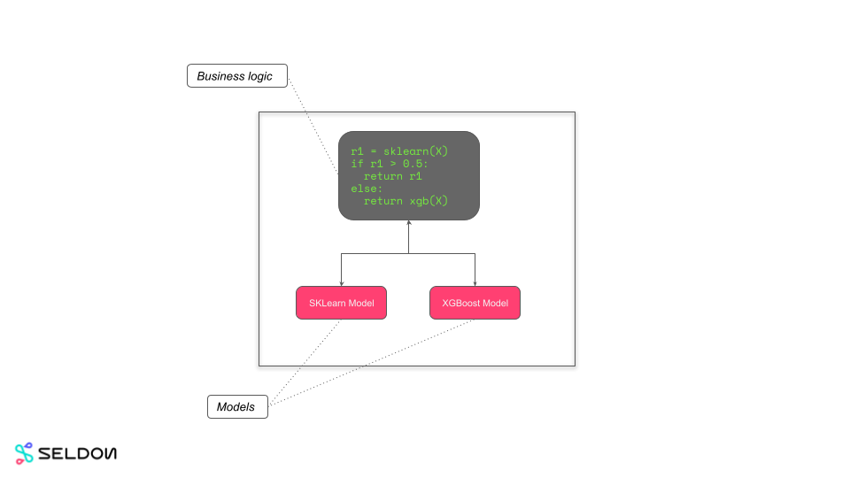

# Introduction to Tempo Example

This notebook will walk you through an end-to-end example deploying a Tempo pipeline, running on its own Conda environment.

## Prerequisites

  * rclone and conda installed.
  * Run this notebook within the `seldon-examples` conda environment. Details to create this can be found [here]().

## Architecture

We will show two Iris dataset prediction models combined with service orchestration that shows some arbitrary python code to control predictions from the two models.




```python
from IPython.core.magic import register_line_cell_magic

@register_line_cell_magic
def writetemplate(line, cell):
    with open(line, 'w') as f:
        f.write(cell.format(**globals()))
```

## Train Iris Models

We will train:

  * A sklearn logistic regression model
  * A xgboost model


```bash
%%bash
mkdir -p ./artifacts/sklearn
mkdir -p ./artifacts/xgboost
```


```python
from sklearn import datasets
from sklearn.linear_model import LogisticRegression
import joblib
iris = datasets.load_iris()
X = iris.data  # we only take the first two features.
y = iris.target
logreg = LogisticRegression(C=1e5)
logreg.fit(X, y)
logreg.predict_proba(X[0:1])
with open("./artifacts/sklearn/model.joblib","wb") as f:
    joblib.dump(logreg, f)
```


```python
from xgboost import XGBClassifier
clf = XGBClassifier()
clf.fit(X,y)
clf.save_model("./artifacts/xgboost/model.bst")
```

## Defining pipeline

The first step will be to define our custom pipeline.
This pipeline will access 2 models, stored remotely. 


```python
import os
import numpy as np
from typing import Tuple
from tempo.serve.metadata import ModelFramework, KubernetesOptions
from tempo.serve.model import Model
from tempo.serve.pipeline import PipelineModels
from tempo.seldon.protocol import SeldonProtocol
from tempo.seldon.docker import SeldonDockerRuntime
from tempo.kfserving.protocol import KFServingV2Protocol
from tempo.serve.utils import pipeline, predictmethod
from tempo.seldon.k8s import SeldonKubernetesRuntime
from tempo.serve.utils import pipeline
from tempo.serve.loader import save

import logging
logging.basicConfig(level=logging.INFO)

SKLEARN_FOLDER = os.getcwd()+"/artifacts/sklearn"
XGBOOST_FOLDER = os.getcwd()+"/artifacts/xgboost"
PIPELINE_ARTIFACTS_FOLDER = os.getcwd()+"/artifacts/classifier"

sklearn_model = Model(
        name="test-iris-sklearn",
        platform=ModelFramework.SKLearn,
        protocol=SeldonProtocol(),
        local_folder=SKLEARN_FOLDER,
        uri="s3://tempo/basic/sklearn"
)

xgboost_model = Model(
        name="test-iris-xgboost",
        platform=ModelFramework.XGBoost,
        protocol=SeldonProtocol(),
        local_folder=XGBOOST_FOLDER,
        uri="s3://tempo/basic/xgboost"
)

@pipeline(name="classifier",
    uri="s3://tempo/basic/pipeline",
    local_folder=PIPELINE_ARTIFACTS_FOLDER,
    models=PipelineModels(sklearn=sklearn_model, xgboost=xgboost_model)
)
class Classifier:
    
    @predictmethod
    def classifier(self, payload: np.ndarray) -> Tuple[np.ndarray,str]:
        res1 = self.models.sklearn(payload)

        if res1[0][0] > 0.5:
            return res1,"sklearn prediction"
        else:
            return self.models.xgboost(payload),"xgboost prediction"
```


```python
classifier = Classifier()
```

## Deploying pipeline to Docker

The next step, will be to deploy our pipeline to Docker.
We will divide this process into 2 steps:

1. Save our artifacts and environment
2. Deploy resources

### Saving artifacts

We provide a conda yaml in out `local_folder` which tempo will use as the runtime environment to save. If this file was not there it would save the current conda environment. One can also provide a named conda environment with `conda_env` in the decorator.


```python
import os
import sys

PYTHON_VERSION = f"{sys.version_info.major}.{sys.version_info.minor}.{sys.version_info.micro}"
TEMPO_DIR = os.path.abspath(os.path.join(os.getcwd(), '..', '..', '..'))
```


```python
%%writetemplate artifacts/conda.yaml
name: tempo
channels:
  - defaults
dependencies:
  - python=3.7
  - pip:
    - mlops-tempo @ file://{TEMPO_DIR}
    - mlserver==0.3.1.dev7
```


```python
docker_runtime = SeldonDockerRuntime()
save(classifier, save_env=True)
```

### Deploying pipeline


```python
docker_runtime.deploy(classifier)
docker_runtime.wait_ready(classifier)
```

### Sending requests

We can send requests to the deployed components with either the python code for the classifier running locally or remotely. 

First we test calling the classifer locally. It will call out to the remote models running in Docker.


```python
classifier(payload=np.array([[1, 2, 3, 4]]))
```

Now we can use the `.remote` method to call to the remote classifier running in Docker.


```python
classifier.remote(payload=np.array([[1, 2, 3, 4]]))
```


```python
classifier.remote(payload=np.array([[5.964,4.006,2.081,1.031]]))
```

### Undeploy pipeline


```python
docker_runtime.undeploy(classifier)
```
